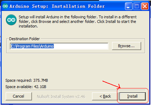

# 3、Arduino

# 3.1、Arduino IDE和驱动的安装

当我们拿到开发板时，首先我们要安装Arduino IDE和驱动，相关文件我们可以在官网上找到，以下链接是包含各种系统、各种版本的Arduino IDE和驱动任你选择。

<https://www.arduino.cc/en/Main/OldSoftwareReleases#1.5.x>

下面我们介绍下Arduino-1.5.6 版本IDE在Windows系统的安装方法。

下载下来的文件是一个arduino-1.5.6-r2-windows.zip的压缩文件夹，解压出来到硬盘。

双击Arduino-1.5.6 .exe文件


然后


然后



等待安装完成.点击close，安装完成。


1.5.6版本安装后的样子。


接下来是开发板驱动的安装，这次我们安装的是Keyes UNO R3开发板的驱动，Keyes 2560 R3开发板安装驱动方法和这个类似，驱动文件可以用同一个文件。

不同的系统，安装驱动的方法也有一些细小的区别，下面我们介绍在WIN 7系统安装驱动的方法。

第一次Keyes UNO R3开发板连接电脑时，点击计算机--属性--设备管理器，显示如下图。


点击 Unknown device 安装驱动，如下图。


进入下图，选择


找到Arduino安装位置的drivers文件夹


点击“Next”，今天下图选择，开始安装驱动


安装驱动完成，出现下图点击Close。

这样驱动就装好了。点击计算机--属性--设备管理器，我们可看见如下图。


# 3.2、Arduino IDE的使用方法

Keyes UNO R3开发板的USB驱动安装成功之后，我们可以在Windows设备管理器中找到相应的串口。

下面示范第一个程序的烧写，串口监视器中显示“Hello World！”。

测试代码为：

```
int val;

int ledpin=13;

void setup()

{

    Serial.begin(9600);

    pinMode(ledpin,OUTPUT);

}

void loop()

{

    val=Serial.read();

    if(val=='R')

    {

        digitalWrite(ledpin,HIGH);

        delay(500);

        digitalWrite(ledpin,LOW);

        delay(500);

        Serial.println("Hello World!");

    }

}
```

我们打开Arduino 的软件，编写一段程序让Keyes UNO R3开发板接受到我们发的指令就显示“Hello World！”字符串；我们再借用一下Keyes UNO R3 开发板上的 D13的指示灯，让Keyes UNO R3开发板接受到指令时指示灯闪烁一下，再显示“Hello World！”。

打开Arduino 的软件，设置板，如下。


设置COM端口，如下


点击编译程序，检查程序是否错误；点击上传程序；Keyes UNO R3 开发板设置OK后右下脚显示如下图，和设备管理器中显示一致。


上传成功，输入R，点击发送，Keyes UNO R3 开发板上的 D13的指示灯闪烁一次，串口监视器中显示 Hello World! 如下图


那么恭喜你，你的第一个程序已经成功了！！！

# 3.3、实验课程

## 实验一 LED 闪烁实验

实验说明

LED 闪烁实验是比较基础的实验之一，上一个“ Hello World！”实验里已经利用到了Arduino 自带的LED，这次我们利用其他I/O口和外接直插LED 灯来完成这个实验。

实验器材

开发板*1

USB线*1

LED*1

220Ω 电阻*1

面包板*1

面包板连接线若干

接线图


测试代码

```
int led = 2; //定义数字口2

void setup()

{

  pinMode(led, OUTPUT);     //设置led为输出

}

void loop()

{

  digitalWrite(led, HIGH);   //开启led

  delay(1000); //延迟1秒

  digitalWrite(led, LOW);    //关闭led

  delay(1000);//延迟1秒

}
```

测试结果

下载完程序就可以看到我们的IO口外接小灯在闪烁了，这样我们的实验现象为LED不停闪烁，间隔大约为1秒。

## 实验二 呼吸灯实验

实验说明

上一课程中我们只是控制LED的亮和灭，那么我们可以怎么控制LED的亮度呢？本课程中我们把LED接到PWM口中，然后通过改变PWM数值，调节LED亮度，使LED逐渐变亮，和逐渐变暗，从而达到呼吸灯的效果。

实验器材

开发板*1

USB线*1

LED*1

220Ω 电阻*1

面包板*1

面包板连接线若干

接线图


测试代码

```
int ledPin = 3; // 定义数字口3

void setup()

{

	pinMode(ledPin, OUTPUT);// 将ledPin设置为输出

}

void loop()

{

    for (int a=0; a<=255;a++)// 设置使LED逐渐变亮

    {

        analogWrite(ledPin,a); //开启led,调节亮度，范围是0-255，在255时led最亮

        delay(10); // 延迟0.01S

    }

    for (int a=255; a>=0;a--) // 设置使LED逐渐变暗

    {

        analogWrite(ledPin,a); //开启led,调节亮度，范围是0-255，在255时led最亮

        delay(10); // 延迟0.01秒

    }

    delay(1000);// 延迟1秒

}
```

测试结果

下载完程序就可以看到我们的IO口外接小灯显示出呼吸灯的效果，小灯先逐渐变亮，后逐渐变暗，循环交替。

## 实验三 广告灯实验

实验说明

在生活中我们经常会看到一些由各种颜色的led灯组成的广告牌，广告牌上各个位置上癿led灯不断的变话,形成各种效果。本节实验就是利用led灯编程模拟广告灯效果。

实验器材

开发板*1

USB线*1

LED\*5

220Ω 电阻\*5

面包板*1

面包板连接线若干

接线图


测试代码

```
int BASE = 2 ; //第一个 LED 接的 I/O 口

int NUM = 5; //LED 的总数

void setup()

{

    for (int i = BASE; i < BASE + NUM; i ++)

    {

    	pinMode(i, OUTPUT); //设定数字I/O口为输出

    }

}

void loop()

{

    for (int i = BASE; i < BASE + NUM; i ++)

    {

        digitalWrite(i, HIGH); //设定数字I/O口输出为"高"，即逐渐开灯

        delay(200); //延迟

    }

    for (int i = BASE; i < BASE + NUM; i ++)

    {

        digitalWrite(i, LOW); //设定数字I/O口输出为"低"，即逐渐关灯

        delay(200); //延迟

    }

}
```

测试结果

下载完程序就可以看到我们的IO口外接小灯先逐渐变亮，然后逐渐变暗，循环交替。

## 实验四 交通灯实验 

实验说明

前面我们已经完成了单个小灯的控制实验，接下来我们就来做一个稍微复杂一点的交通灯实验，其实聪明的朋友们可以看出来这个实验就是将上面单个小灯的实验扩展成3个颜色的小灯，就可以实现我们模拟交通灯的实验了。

实验器材

红色LED*1

黄色LED*1

绿色LED*1

220Ω电阻\*3

面包板*1

面包板连接线若干

接线图


测试代码

```
int redled =10; //定义数字10 接口

int yellowled =7; //定义数字7 接口

int greenled =4; //定义数字4 接口

void setup()

{

    pinMode(redled, OUTPUT);//定义红色小灯接口为输出接口

    pinMode(yellowled, OUTPUT); //定义黄色小灯接口为输出接口

    pinMode(greenled, OUTPUT); //定义绿色小灯接口为输出接口

}

void loop()

{

    digitalWrite(greenled, HIGH);////点亮 绿灯

    delay(5000);//延时5秒

    digitalWrite(greenled, LOW); //熄灭 绿灯

    for(int i=0;i<3;i++)//闪烁交替三次，黄灯闪烁效果

    {

        delay(500);//延时0.5 秒

        digitalWrite(yellowled, HIGH);//点亮 黄灯

        delay(500);//延时0.5 秒

        digitalWrite(yellowled, LOW);//熄灭 黄灯

    }

    delay(500);//延时0.5 秒

    digitalWrite(redled, HIGH);//点亮 红灯

    delay(5000);//延时5 秒

    digitalWrite(redled, LOW);//熄灭 红灯

}
```

测试结果

按照接线图接好线，上传完程序，上电后，我们就可以看到我们自己设计控制的交通灯了。实验效果为绿灯亮5秒，绿灯熄灭，黄灯循环闪烁3次，红灯亮5秒，依次循环。

## 实验五 按键控制LED实验

实验说明

I/O 口的意思即为INPUT 接口和OUTPUT接口，到目前为止我们设计的小灯实验都还只是应用到Arduino 的I/O口的输出功能，这个实验我们来尝试一下使用Arduino的I/O口的输入功能即为读取外接设备的输出值，我们用一个按键和一个LED小灯完成一个输入输出结合使用的实验，让大家能简单了解I/O 的作用。

实验器材

开发板 *1

USB线*1

LED*1

轻触按键*1

220Ω 电阻*1

10KΩ 电阻*1

面包板*1

面包板连接线若干

接线图


测试代码

```
int ledPin = 11; //定义数字口11

int inputPin = 3; //定义数字口3

void setup()

{

    pinMode(ledPin, OUTPUT); //将ledPin设置为输出

    pinMode(inputPin, INPUT); //将inputPin设置为输入

}

void loop()

{

    int val = digitalRead(inputPin);//设置数字变量val，读取到数字口3的数值，并赋值给 val

    if (val == LOW) //当val为低电平时，LED变暗

    {

    	digitalWrite(ledPin, LOW); // LED变暗

    }

    else

    {

    	digitalWrite(ledPin, HIGH); // LED亮起

    }

}
```

测试结果

下载完程序，上电后，当按键按下时小灯亮起，否则小灯不亮。

## 实验六 抢答器实验

实验说明

完成上面的实验以后相信已经有很多朋友可以独立完成这个实验了，我们可以将上面的按键控制小灯的实验扩展成4个按键对应3个小灯，占用7个数字I/O接口。为方便接线，我们把3个小灯用一个RGB灯代替。RGB灯可通过 R、 G、B三个引脚的PWM电压输入可以调节三种基色（红/蓝/绿）的强度从而实现全彩的混色效果。

本实验中我们利用4个按键控制3个PWM口，控制RGB模块发光颜色从而达到抢答器的效果。RGB灯接口说明如下图。


实验器材

开发板*1

USB线*1

RGB灯*1

轻触按键\*4

10KΩ 电阻\*4

220Ω 电阻*1

面包板*1

面包板连接线若干

杜邦线若干

接线图


测试代码

```
// 定义LED控制引脚（PWM输出）
int redled = 9;                     // 红色LED连接数字引脚9
int greenled = 10;                  // 绿色LED连接数字引脚10
int blueled = 11;                   // 蓝色LED连接数字引脚11

// 定义按钮输入引脚
int redpin = 5;                     // 红色按钮连接数字引脚5
int greenpin = 4;                   // 绿色按钮连接数字引脚4
int bluepin = 3;                    // 蓝色按钮连接数字引脚3
int restpin = 2;                    // 复位按钮连接数字引脚2

// 按钮状态变量
int red;                            // 存储红色按钮状态
int green;                          // 存储绿色按钮状态
int blue;                           // 存储蓝色按钮状态

void setup()
{
  // 初始化LED引脚为输出模式
  pinMode(redled, OUTPUT);          // 设置红色LED为输出
  pinMode(greenled, OUTPUT);        // 设置绿色LED为输出
  pinMode(blueled, OUTPUT);         // 设置蓝色LED为输出
  
  // 初始化按钮引脚为输入模式
  pinMode(redpin, INPUT);           // 设置红色按钮为输入
  pinMode(greenpin, INPUT);         // 设置绿色按钮为输入
  pinMode(bluepin, INPUT);          // 设置蓝色按钮为输入
}

void loop()
{
  // 读取按钮状态（按下时为LOW）
  red = digitalRead(redpin);        // 读取红色按钮
  green = digitalRead(greenpin);    // 读取绿色按钮
  blue = digitalRead(bluepin);      // 读取蓝色按钮

  // 检测按钮按下并执行对应函数
  if(red == LOW) RED_YES();         // 红色按钮按下触发红色模式
  if(green == LOW) GREEN_YES();     // 绿色按钮按下触发绿色模式
  if(blue == LOW) BLUE_YES();       // 蓝色按钮按下触发蓝色模式
}

// 红色模式控制函数
void RED_YES()
{
  while(digitalRead(restpin) == 1)  // 当复位按钮未按下时保持
  {
    color(255, 0, 0);               // 输出纯红色（R=255,G=0,B=0）
  }
  clear_led();                      // 退出后清除LED状态
}

// 绿色模式控制函数
void GREEN_YES()
{
  while(digitalRead(restpin) == 1)  // 当复位按钮未按下时保持
  {
    color(0, 255, 0);               // 输出纯绿色（R=0,G=255,B=0）
  }
  clear_led();                      // 退出后清除LED状态
}

// 蓝色模式控制函数
void BLUE_YES()
{
  while(digitalRead(restpin) == 1)  // 当复位按钮未按下时保持
  {
    color(0, 0, 255);               // 输出纯蓝色（R=0,G=0,B=255）
  }
  clear_led();                      // 退出后清除LED状态
}

// 清除所有LED显示
void clear_led()
{
  color(0, 0, 0);                   // 输出黑色（R=0,G=0,B=0）
}

// RGB颜色控制函数
void color(unsigned char red, unsigned char green, unsigned char blue)
{
  analogWrite(redled, red);         // 设置红色LED亮度（0-255）
  analogWrite(greenled, green);     // 设置绿色LED亮度（0-255）
  analogWrite(blueled, blue);       // 设置蓝色LED亮度（0-255）
}
```

测试结果

下载完程序，上电后，一个简单的抢答器就做好了，我们根据RGB灯显示的颜色判断是谁抢答成功。在复位后。RGB灯关闭。

## 实验七 魔术光杯实验

实验说明

倾斜开关的工作原理是当开关一端低于水平位置倾斜，开关寻通；当另一端低于水平位置倾斜，开关停止。魔术光杯实验原理是利用 PWM调光的原理，两个LED的亮度发生变化。

这个实验中倾斜开关提供数字信号，触发 PWM的调节，通过程序的设计，我们就能看到类似于两组装满光的杯子倒来倒去的效果了。

实验器材

开发板*1

USB线*1

LED\*2

倾斜开关\*2

220Ω 电阻\*2

10KΩ 电阻\*2

面包板*1

面包板连接线若干

接线图


测试代码

```
int LedPinA = 5; //定义数字口5

int LedPinB = 6; //定义数字口6

int ButtonPinA = 7;//定义数字口7

int ButtonPinB = 4;//定义数字口4

int buttonStateA = 0;

int buttonStateB = 0;

int brightnessA = 0;

int brightnessB= 255;

void setup()

{

    Serial.begin(9600);//设置波特率

    pinMode(LedPinA, OUTPUT);//数字口5设置为输出

    pinMode(LedPinB, OUTPUT);//数字口6设置为输出

    pinMode(ButtonPinA, INPUT);//数字口7设置为输入

    pinMode(ButtonPinB, INPUT);//数字口4设置为输入

}

void loop()

{

    buttonStateA =digitalRead(ButtonPinA);//读取数字口7的数值赋值给buttonStateA

    if (buttonStateA == HIGH && brightnessA != 255)//当buttonStateA为高电平且brightnessA不为255
    {

        brightnessA ++;//brightnessA加1

        delay(10);//延迟0.01S

    }

    if (buttonStateA == LOW && brightnessA != 0)//当buttonStateA为低电平且brightnessA不为0

    {

        brightnessA --;//brightnessA减1

        delay(10);//延迟0.01S

    }

    analogWrite(LedPinB, brightnessA);//将brightnessA赋值为给PWM口6

    Serial.print(brightnessA);//显示brightnessA数值

    Serial.print(" ");

    buttonStateB =digitalRead(ButtonPinB);//读取数字口4的数值赋值给buttonStateB

    if (buttonStateB == HIGH && brightnessB != 0)//当buttonStateB为高电平且brightnessA不为0

    {

        brightnessB --;//brightnessB减1

        delay(10);//延迟0.01S

    }

    if (buttonStateB == LOW && brightnessB != 255)//当buttonStateB为低电平且brightnessA不为255

    {

        brightnessB++;//brightnessB加1

        delay(10);//延迟0.01S

    }

    analogWrite(LedPinA, brightnessB); //将brightnessB赋值为给PWM口5

    Serial.println(brightnessB);//显示brightnessB数值，并自动换行

    delay(5);

}
```

测试结果

按照上图接好线，烧录好代码，上电后，将两个倾斜开关同时倾斜一边，一个LED逐渐变暗，同时另一个逐渐变亮，最终一个LED完全熄灭，一个LED最亮；在串口监视器中看到对应具体数值变化，如下图。当倾斜另一边中，现象一样，方向相反。


## 实验八 电位器调控灯光亮度实验

实验说明

在第二课程中我们直接通过PWM口控制灯的亮度，从而达到呼吸灯的效果。在这课程中我们通过一个电位器，利用电位器调节PWM值，从而控制灯的亮度。

实验器材

开发板*1

USB线*1

LED*1

220Ω 电阻*1

可调电位器*1

面包板*1

面包板连接线若干

接线图


测试代码

```
int ledpin=11;//定义数字接口11（PWM 输出）

void setup()

{

    pinMode(ledpin,OUTPUT);//定义数字接口11 为输出

    Serial.begin(9600);//设置波特率为9600

}

void loop()

{

    int val=analogRead(0);//读取模拟口A0口的值

    val = map(val, 0, 1023, 0, 255);//从0-1023映射到0-255

    Serial.println(val);//显示val 变量

    analogWrite(ledpin,val);// 打开LED 并设置亮度

    delay(100);//延时0.1 秒

}
```

测试结果

下载完程序后。我们可以通过旋转可调电位器控制小灯的亮度，打开串口监视器，设置波特率为9600，就可看到调节LED亮度的PWM值。

## 实验九 有源蜂鸣器实验

实验说明

蜂鸣器可分为有源蜂鸣器和无源蜂鸣器两种。本课程中主要用到了有源蜂鸣器，有源蜂鸣器内部有一简单的振荡电路，能将恒定的直流电转化成一定频率的脉冲信号。实验中中我们只需要给蜂鸣器输入一个高电平信号，蜂鸣器响起。

实验器材

开发板*1

USB线*1

有源蜂鸣器*1

面包板*1

面包板连接线若干

接线图


测试代码

```
int buzzer = 2; //定义数字口2

void setup()

{

  pinMode(buzzer, OUTPUT);     //设置buzzer为输出

}

void loop()

{

  digitalWrite(buzzer, HIGH);   //开启buzzer

  delay(1000); //延迟1S

  digitalWrite(buzzer, LOW);    //关闭buzzer

  delay(1000);//延迟1S

}
```

测试结果

下载完程序后，我们可以听到蜂鸣器响1秒，停止响起1秒，循环交替。

## 实验十 无源蜂鸣器实验

实验说明

蜂鸣器可分为有源蜂鸣器和无源蜂鸣器两种。本课程中主要用到了无源蜂鸣器，无源蜂鸣器内部不带振荡源，直流信号无法令其鸣叫，须用方波驱动。

实验器材

开发板 *1

USB线*1

无源蜂鸣器*1

面包板*1

正标线若干

接线图


测试代码

code 1:

```
int buzzer=3; //定义数字口3

void setup()

{

	pinMode(buzzer,OUTPUT);//将buzzer设置为输出

}

void loop()

{

    unsigned char i,j;//定义变量i，j

    while(1)

    {

        for(i=0;i<80;i++)// 输出一个频率的声音

        {

            digitalWrite(buzzer,HIGH);

            delay(1);//延迟1ms

            digitalWrite(buzzer,LOW);

            delay(1);//延迟1ms

        }

        for(i=0;i<100;i++)// 输出另一个频率的声音

        {

            digitalWrite(buzzer,HIGH);

            delay(2);//延迟2ms

            digitalWrite(buzzer,LOW);

            delay(2);//延迟2ms

        }

    }

}
```

code 2:

```
// 定义音符频率（D调音阶）
#define D0 -1      // 休止符
#define D1 262     // 低音Do (C)
#define D2 293     // 低音Re (D)
#define D3 329     // 低音Mi (E)
#define D4 349     // 低音Fa (F)
#define D5 392     // 低音Sol (G)
#define D6 440     // 低音La (A)
#define D7 494     // 低音Si (B)

#define M1 523     // 中音Do (C5)
#define M2 586     // 中音Re (D5)  
#define M3 658     // 中音Mi (E5)
#define M4 697     // 中音Fa (F5)
#define M5 783     // 中音Sol (G5)
#define M6 879     // 中音La (A5)
#define M7 987     // 中音Si (B5)

#define H1 1045    // 高音Do (C6)
#define H2 1171    // 高音Re (D6)
#define H3 1316    // 高音Mi (E6)
#define H4 1393    // 高音Fa (F6)
#define H5 1563    // 高音Sol (G6)
#define H6 1755    // 高音La (A6)
#define H7 1971    // 高音Si (B6)

// 定义节拍时长（单位：拍）
#define WHOLE 1        // 全音符
#define HALF 0.5       // 二分音符  
#define QUARTER 0.25   // 四分音符
#define EIGHTH 0.25    // 八分音符
#define SIXTEENTH 0.625 // 十六分音符

// 乐曲音符序列（《欢乐颂》旋律）
int tune[] = 
{
  M3,M3,M4,M5,        // 小节1
  M5,M4,M3,M2,        // 小节2
  M1,M1,M2,M3,        // 小节3
  M3,M2,M2,           // 小节4
  M3,M3,M4,M5,        // 小节5
  M5,M4,M3,M2,        // 小节6
  M1,M1,M2,M3,        // 小节7
  M2,M1,M1,           // 小节8
  M2,M2,M3,M1,        // 小节9
  M2,M3,M4,M3,M1,     // 小节10
  M2,M3,M4,M3,M2,     // 小节11
  M1,M2,D5,D0,        // 小节12
  M3,M3,M4,M5,        // 小节13
  M5,M4,M3,M4,M2,     // 小节14
  M1,M1,M2,M3,        // 小节15
  M2,M1,M1            // 小节16
};

// 对应节拍序列  
float durt[] =
{
  1,1,1,1,           // 小节1（四分音符×4）
  1,1,1,1,           // 小节2
  1,1,1,1,           // 小节3
  1+0.5,0.5,1+1,     // 小节4（附点二分+四分+全）
  1,1,1,1,           // 小节5
  1,1,1,1,           // 小节6
  1,1,1,1,           // 小节7
  1+0.5,0.5,1+1,     // 小节8
  1,1,1,1,           // 小节9
  1,0.5,0.5,1,1,     // 小节10（四分+八分×2+四分×2）
  1,0.5,0.5,1,1,     // 小节11
  1,1,1,1,           // 小节12
  1,1,1,1,           // 小节13
  1,1,1,0.5,0.5,     // 小节14
  1,1,1,1,           // 小节15
  1+0.5,0.5,1+1,     // 小节16
};

int length;            // 乐曲总音符数
int tonepin = 3;       // 蜂鸣器连接引脚（必须支持PWM）

void setup()
{
  pinMode(tonepin, OUTPUT);  // 设置蜂鸣器引脚为输出模式
  length = sizeof(tune)/sizeof(tune[0]); // 计算音符数组长度
}

void loop() 
{
  for(int x=0; x<length; x++)  // 遍历所有音符
  {
    tone(tonepin, tune[x]);    // 播放当前音符频率
    delay(500*durt[x]);        // 根据节拍延时（500ms基准）
    noTone(tonepin);           // 停止当前音符
  }
  delay(2000);                 // 曲目结束后暂停2秒
}
```

测试结果

实验中我们提供了两个例程，上传例程1代码后，蜂鸣器会发出两种不同的声音，实验中，两种声音循环交替。上传例程2中代码后，蜂鸣器会想响起《欢乐颂》的曲子。

## 实验十一 感光灯实验

实验说明

完成以上的各种实验后，我们对Arduino的应用也应该有一些认识和了解了，在基本的数字量输入输出和模拟量输入以及PWM的产生都掌握以后，我们就可以开始进行一些传感器的应用了。

本次实验我们先进行一个较为简单的光敏电阻的使用实验。光敏电阻既然是可以根据光强改变阻值的元件，自然也需要模拟口读取模拟值了，本实验可以借鉴电位器调控灯光亮度实验，将电位计换做光敏电阻实现当光强不同时LED小灯的亮度也会有相应的变化。

实验器材

开发板*1

USB线*1

LED*1

220Ω 电阻*1

10KΩ 电阻*1

光敏电阻*1

面包板*1

面包板连接线若干

接线图


测试代码

```
int ledpin=11;//定义数字接口11（PWM 输出）

void setup()

{

    pinMode(ledpin,OUTPUT);//定义数字接口11 为输出

    Serial.begin(9600);//设置波特率为9600

}

void loop()

{

    int val=analogRead(0);//读取模拟口A0口的值

    Serial.println(val);//显示val 变量

    val = map(val, 0, 1023, 0, 255);//从0-1023映射到0-255

    analogWrite(ledpin,255-val);// 打开LED 并设置亮度

    delay(10);//延时0.01 秒

}
```

测试结果

下载完程序后，光敏电阻感应到灯光越亮，小灯越暗；光敏电阻感应到灯光越暗，小灯越亮。打开串口监视器，设置波特率为9600，就可看到光敏电阻感应到外界光强所得的模拟值。

## 实验十二 火焰报警实验

实验说明

火焰传感器是机器人专门用来搜寻火源的传感器，本传感器对火焰特别灵敏。火焰传感器利用红外线对火焰非常敏感的特点，使用特制的红外线接收管来检测火焰，然后把火焰的亮度转化为高低变化的电平信号。

实验中，我们把火焰的亮度转化为高低变化的电平信号输入到UNO板中，然后控制蜂鸣器的响起。

实验器材

开发板*1

USB线*1

有源蜂鸣器*1

火焰传感器*1

10KΩ 电阻*1

面包板*1

面包板连接线若干

接线图


测试代码

```
int flame=7;//定义火焰接口为数字7 接口

int Beep=9;//定义蜂鸣器接口为数字9 接口

void setup()

{

    pinMode(Beep,OUTPUT);//定义Beep为输出接口

    pinMode(flame,INPUT);//定义flame为输入接口

}

void loop()

{

    int val=digitalRead(flame);//读取火焰传感器

    if(val==HIGH)//当数字口7为高电平时蜂鸣器鸣响

    {

    	digitalWrite(Beep,HIGH);

    }
    else

    {

    	digitalWrite(Beep,LOW);

    }

    delay(500);

}
```

测试结果

下载完程序后，我们可以模拟在有火焰时报警的情况，在没有火焰时一切正常，当有火焰时立刻报警做出提示。

## 实验十三 热敏电阻传感器实验

实验说明

热敏电阻能够实时感知周边环境温度的变化，随着温度变化，热敏电阻也发生变化。实验中，我们搭配好电路，把温度变化转换成电压变化，将对应的电压输入到Arduino UNO的模拟口上，并在串口监视器上显示出对应的模拟值。

实验器材

开发板*1

USB线*1

热敏电阻*1

10KΩ 电阻*1

面包板*1

面包板连接线若干

接线图


测试代码

```
void setup()
{
  Serial.begin(9600);          // 初始化串口通信，波特率9600bps
}

void loop()
{
  int val;                    // 定义存储传感器值的整型变量
  val = analogRead(0);        // 读取模拟引脚0的值（0-1023）
  Serial.println(val, DEC);   // 以十进制格式输出数值到串口
  delay(100);                 // 采样间隔100毫秒（10Hz采样率）
}
```

测试结果

按照上图接好线，上传好代码，上电后，我们就可以看串口监视器上看到代表当前温度的模拟值。当温度升高，电阻减小，模拟值增大；当人体对准温度电阻呼气时，温度升高，显示如下图。


## 实验十四 LM35检测温度

实验说明

LM35 是很常用且易用的温度传感器元件。实验中我们将LM35温度传感器接到开发板上，通过算法可将读取的模拟值转换为实际的温度，并在Arduino IDE的串口监视器上显示该温度值。

实验时，需特别注意LM35的方向，如若接反，会把LM35传感器烧毁，接口方向如下。


实验器材

开发板 *1

USB线*1

LM35DZ*1

面包板*1

面包板连接线若干

接线图


测试代码

```
void setup()

{

	Serial.begin(9600);//设置波特率

}

void loop()

{

    int val; //定义数字变量val

    int dat;//定义数字变量dat

    val=analogRead(0);//将val设置为读取到的A0的数值

    dat=(500 * val) /1024; //计算出当前温度数字dat

    Serial.print("Temp:"); //显示 Temp:

    Serial.print(dat); //显示计算的温度值

    Serial.println("C");//显示C，并自动换行

    delay(500); //延迟0.5S

}
```

测试结果

按照上图接好线，上传好代码，上电后，我们可以在软件的串口监视器中看到当前环境中的温度值，如下图。


## 实验十五 一位数码管显示实验

实验说明

数码管是一种半导体发光器件，其基本单元是发光二极管。数码管按段数分为七段数码管和八段数码管，八段数码管比七段数码管多一个发光二极管单元（多一个小数点显示），本实验所使用的是八段数码管。数码管共有七段显示数字的段，还有一个显示小数点的段。当让数码管显示数字时，只要将相应的段点亮即可。

实验器材

开发板 *1

USB线*1

一位数码管*1

220Ω 电阻\*8

面包板*1

面包板连接线若干

接线图


测试代码

```
// 定义数码管各段对应引脚
int a = 7;      // a段连接数字引脚7
int b = 6;      // b段连接数字引脚6
int c = 5;      // c段连接数字引脚5
int d = 10;     // d段连接数字引脚10（原注释有误，应为10）
int e = 11;     // e段连接数字引脚11（原注释有误，应为11）
int f = 8;      // f段连接数字引脚8
int g = 9;      // g段连接数字引脚9
int dp = 4;     // 小数点连接数字引脚4

// 数字1显示函数
void digital_1(void) 
{
  unsigned char j;
  digitalWrite(c, HIGH);  // 点亮c段
  digitalWrite(b, HIGH);  // 点亮b段
  for(j = 7; j <= 11; j++) // 熄灭其他段（a,d,e,f,g）
    digitalWrite(j, LOW);
  digitalWrite(dp, LOW);  // 熄灭小数点
}

// 数字2显示函数（保持原始实现）
void digital_2(void) 
{
  unsigned char j;
  digitalWrite(b, HIGH);
  digitalWrite(a, HIGH);
  for(j = 9; j <= 11; j++)
    digitalWrite(j, HIGH);
  digitalWrite(dp, LOW);
  digitalWrite(c, LOW);
  digitalWrite(f, LOW);
}

// 数字3显示函数（保持原始实现）
void digital_3(void) 
{
  unsigned char j;
  digitalWrite(g, HIGH);
  digitalWrite(d, HIGH);
  for(j = 5; j <= 7; j++)
    digitalWrite(j, HIGH);
  digitalWrite(dp, LOW);
  digitalWrite(f, LOW);
  digitalWrite(e, LOW);
}

// 数字4显示函数（保持原始实现）
void digital_4(void) 
{
  digitalWrite(c, HIGH);
  digitalWrite(b, HIGH);
  digitalWrite(f, HIGH);
  digitalWrite(g, HIGH);
  digitalWrite(dp, LOW);
  digitalWrite(a, LOW);
  digitalWrite(e, LOW);
  digitalWrite(d, LOW);
}

// 数字5显示函数（保持原始实现）
void digital_5(void) 
{
  unsigned char j;
  for(j = 7; j <= 9; j++)
    digitalWrite(j, HIGH);
  digitalWrite(c, HIGH);
  digitalWrite(d, HIGH);
  digitalWrite(dp, LOW);
  digitalWrite(b, LOW);
  digitalWrite(e, LOW);
}

// 数字6显示函数（保持原始实现）
void digital_6(void) 
{
  unsigned char j;
  for(j = 7; j <= 11; j++)
    digitalWrite(j, HIGH);
  digitalWrite(c, HIGH);
  digitalWrite(dp, LOW);
  digitalWrite(b, LOW);
}

// 数字7显示函数（保持原始实现）
void digital_7(void) 
{
  unsigned char j;
  for(j = 5; j <= 7; j++)
    digitalWrite(j, HIGH);
  digitalWrite(dp, LOW);
  for(j = 8; j <= 11; j++)
    digitalWrite(j, LOW);
}

// 数字8显示函数（全段点亮）
void digital_8(void) 
{
  unsigned char j;
  for(j = 5; j <= 11; j++)
    digitalWrite(j, HIGH);
  digitalWrite(dp, LOW);
}

void setup() 
{
  int i;
  for(i = 4; i <= 11; i++)
    pinMode(i, OUTPUT);  // 初始化4-11引脚为输出模式
}

void loop() 
{
  while(1) 
  {  // 永久循环
    digital_1(); delay(2000);  // 显示1，延时2秒
    digital_2(); delay(1000);  // 显示2，延时1秒
    digital_3(); delay(1000);  // 显示3，延时1秒
    digital_4(); delay(1000);  // 显示4，延时1秒
    digital_5(); delay(1000);  // 显示5，延时1秒
    digital_6(); delay(1000);  // 显示6，延时1秒
    digital_7(); delay(1000);  // 显示7，延时1秒
    digital_8(); delay(1000);  // 显示8，延时1秒
  }
}
```

测试结果

下载完程序后，数码管循环显示1～8 数字。

## 实验十六 74HC595驱动一位数码管实验

实验说明

上一个实验中我们直接把用开发板控制一位数码管，需要占用了较多的数字口，本实验中我们添加了一个74HC595芯片控制一位数码管，只需要用3个数字口就可以控制8个LED灯，具体设置方法可以参照以下表格。


||Q7|Q6|Q5|Q4|Q3|Q2|Q1|Q0||
|-|-|-|-|-|-|-|-|-|-|
||a|b|c|d|e|f|g|dp||
|0|1|1|1|1|1|1|0|0|252|
|1|0|1|1|0|0|0|0|0|96|
|2|1|1|0|1|1|0|1|0|218|
|3|1|1|1|1|0|0|1|0|242|
|4|0|1|1|0|0|1|1|0|102|
|5|1|0|1|1|0|1|1|0|182|
|6|1|0|1|1|1|1|1|0|190|
|7|1|1|1|0|0|0|0|0|224|
|8|1|1|1|1|1|1|1|0|254|
|9|1|1|1|1|0|1|1|0|246|


实验器材

开发板*1

USB线*1

74HC595*1

一位数码管*1

220Ω 电阻\*8

面包板*1

面包板连接线若干

接线图


测试代码

```
// 74HC595引脚定义
int latchPin = 4;    // ST_CP (12) 存储寄存器时钟输入
int clockPin = 5;    // SH_CP (11) 移位寄存器时钟输入
int dataPin = 2;     // DS (14) 串行数据输入

void setup() 
{
  // 设置所有控制引脚为输出模式
  pinMode(latchPin, OUTPUT);
  pinMode(clockPin, OUTPUT);
  pinMode(dataPin, OUTPUT);
}

void loop() 
{
  // 数码管段码表（共阳极编码）
  int a[10] = 
  { 
    246, // 0 → 0b11110110
    254, // 1 → 0b11111110
    224, // 2 → 0b11100000
    190, // 3 → 0b10111110
    182, // 4 → 0b10110110
    102, // 5 → 0b01100110
    242, // 6 → 0b11110010
    218, // 7 → 0b11011010
    96,  // 8 → 0b01100000
    252  // 9 → 0b11111100
  };
  
  // 倒计时循环（9到0）
  for(int x=9; x>-1; x--) 
  {
    digitalWrite(latchPin, LOW);  // 准备数据传输
    shiftOut(dataPin, clockPin, MSBFIRST, a[x]); // 发送段码数据
    digitalWrite(latchPin, HIGH); // 更新显示输出
    delay(1000);                 // 显示保持1秒
  }
}
```

测试结果

下载完程序后，数码管循环显示0～9 数字。

## 实验十七 四位数码管显示数字实验

实验说明

在实验十五中我们使用开发板驱动一个一位数码管，本实验我们使用开发板驱动一个共阴四位数码管。驱动数码管限流电阻肯定是必不可少的，限流电阻有两种接法，一种是在d1-d4阴极接，总共接4颗。这种接法好处是需求电阻比较少，但是会产生每一位上显示不同数字亮度会不一样，1最亮，8最暗。另外一种接法就是在其他8个引脚上接，这种接法亮度显示均匀，但是用电阻较多。本次实验使用8颗220Ω电阻。

四位数码管总共有12个引脚，小数点朝下正放在面前时，左下角为1,其他管脚顺序为逆时针旋转。左上角为最大的12号管脚。


四位数码管原理图如下


实验器材

开发板*1

USB线*1

四位数码管*1

220Ω 电阻\*8

面包板*1

面包板连接线若干

接线图


测试代码

```
int a = 1;    // 数码管段a引脚
int b = 2;    // 数码管段b引脚
int c = 3;    // 数码管段c引脚
int d = 4;    // 数码管段d引脚
int e = 5;    // 数码管段e引脚
int f = 6;    // 数码管段f引脚
int g = 7;    // 数码管段g引脚
int dp = 8;   // 数码管小数点引脚

int d4 = 9;   // 数码管位选4
int d3 = 10;  // 数码管位选3
int d2 = 11;  // 数码管位选2
int d1 = 12;  // 数码管位选1

// 设置变量
long n = 1230;  // 初始显示值
int x = 100;    // 未使用变量
int del = 55;   // 时钟微调参数

void setup()
{
    pinMode(d1, OUTPUT);
    pinMode(d2, OUTPUT);
    pinMode(d3, OUTPUT);
    pinMode(d4, OUTPUT);
    pinMode(a, OUTPUT);
    pinMode(b, OUTPUT);
    pinMode(c, OUTPUT);
    pinMode(d, OUTPUT);
    pinMode(e, OUTPUT);
    pinMode(f, OUTPUT);
    pinMode(g, OUTPUT);
    pinMode(dp, OUTPUT);
}

/////////////////////////////////////////////////////////////
void loop()
{
    int a=0;  // 千位数
    int b=0;  // 百位数
    int c=0;  // 十位数
    int d=0;  // 个位数
    unsigned long currentMillis = millis();
    
    while(d>=0)
    {
        while(millis()-currentMillis<1000)  // 每秒更新一次
        {
            Display(1,a);  // 显示千位
            Display(2,b);  // 显示百位
            Display(3,c);  // 显示十位
            Display(4,d);  // 显示个位
        }
        currentMillis = millis();
        d++;
        
        if (d>9)  // 个位进位
        {
            c++;
            d=0;
        }
        
        if (c>9)  // 十位进位
        {
            b++;
            c=0;
        }
        
        if (b>9)  // 百位进位
        {
            a++;
            b=0;
        }
        
        if (a>9)  // 千位进位
        {
            a=0;
            b=0;
            c=0;
            d=0;
        }
    }
}

///////////////////////////////////////////////////////////////
void WeiXuan(unsigned char n)  // 位选函数
{
    switch (n)
    {
        case 1:  // 选中第一位
            digitalWrite(d1, LOW);
            digitalWrite(d2, HIGH);
            digitalWrite(d3, HIGH);
            digitalWrite(d4, HIGH);
            break;
            
        case 2:  // 选中第二位
            digitalWrite(d1, HIGH);
            digitalWrite(d2, LOW);
            digitalWrite(d3, HIGH);
            digitalWrite(d4, HIGH);
            break;
            
        case 3:  // 选中第三位
            digitalWrite(d1, HIGH);
            digitalWrite(d2, HIGH);
            digitalWrite(d3, LOW);
            digitalWrite(d4, HIGH);
            break;
            
        case 4:  // 选中第四位
            digitalWrite(d1, HIGH);
            digitalWrite(d2, HIGH);
            digitalWrite(d3, HIGH);
            digitalWrite(d4, LOW);
            break;
            
        default:  // 默认不选中任何位
            digitalWrite(d1, HIGH);
            digitalWrite(d2, HIGH);
            digitalWrite(d3, HIGH);
            digitalWrite(d4, HIGH);
            break;
    }
}

void Num_0()  // 显示数字0
{
    digitalWrite(a, HIGH);
    digitalWrite(b, HIGH);
    digitalWrite(c, HIGH);
    digitalWrite(d, HIGH);
    digitalWrite(e, HIGH);
    digitalWrite(f, HIGH);
    digitalWrite(g, LOW);
    digitalWrite(dp, LOW);
}

void Num_1()  // 显示数字1
{
    digitalWrite(a, LOW);
    digitalWrite(b, HIGH);
    digitalWrite(c, HIGH);
    digitalWrite(d, LOW);
    digitalWrite(e, LOW);
    digitalWrite(f, LOW);
    digitalWrite(g, LOW);
    digitalWrite(dp, LOW);
}

void Num_2()  // 显示数字2
{
    digitalWrite(a, HIGH);
    digitalWrite(b, HIGH);
    digitalWrite(c, LOW);
    digitalWrite(d, HIGH);
    digitalWrite(e, HIGH);
    digitalWrite(f, LOW);
    digitalWrite(g, HIGH);
    digitalWrite(dp, LOW);
}

void Num_3()  // 显示数字3
{
    digitalWrite(a, HIGH);
    digitalWrite(b, HIGH);
    digitalWrite(c, HIGH);
    digitalWrite(d, HIGH);
    digitalWrite(e, LOW);
    digitalWrite(f, LOW);
    digitalWrite(g, HIGH);
    digitalWrite(dp, LOW);
}

void Num_4()  // 显示数字4
{
    digitalWrite(a, LOW);
    digitalWrite(b, HIGH);
    digitalWrite(c, HIGH);
    digitalWrite(d, LOW);
    digitalWrite(e, LOW);
    digitalWrite(f, HIGH);
    digitalWrite(g, HIGH);
    digitalWrite(dp, LOW);
}

void Num_5()  // 显示数字5
{
    digitalWrite(a, HIGH);
    digitalWrite(b, LOW);
    digitalWrite(c, HIGH);
    digitalWrite(d, HIGH);
    digitalWrite(e, LOW);
    digitalWrite(f, HIGH);
    digitalWrite(g, HIGH);
    digitalWrite(dp, LOW);
}

void Num_6()  // 显示数字6
{
    digitalWrite(a, HIGH);
    digitalWrite(b, LOW);
    digitalWrite(c, HIGH);
    digitalWrite(d, HIGH);
    digitalWrite(e, HIGH);
    digitalWrite(f, HIGH);
    digitalWrite(g, HIGH);
    digitalWrite(dp, LOW);
}

void Num_7()  // 显示数字7
{
    digitalWrite(a, HIGH);
    digitalWrite(b, HIGH);
    digitalWrite(c, HIGH);
    digitalWrite(d, LOW);
    digitalWrite(e, LOW);
    digitalWrite(f, LOW);
    digitalWrite(g, LOW);
    digitalWrite(dp, LOW);
}

void Num_8()  // 显示数字8
{
    digitalWrite(a, HIGH);
    digitalWrite(b, HIGH);
    digitalWrite(c, HIGH);
    digitalWrite(d, HIGH);
    digitalWrite(e, HIGH);
    digitalWrite(f, HIGH);
    digitalWrite(g, HIGH);
    digitalWrite(dp, LOW);
}

void Num_9()  // 显示数字9
{
    digitalWrite(a, HIGH);
    digitalWrite(b, HIGH);
    digitalWrite(c, HIGH);
    digitalWrite(d, HIGH);
    digitalWrite(e, LOW);
    digitalWrite(f, HIGH);
    digitalWrite(g, HIGH);
    digitalWrite(dp, LOW);
}

void Clear()  // 清空数码管显示
{
    digitalWrite(a, LOW);
    digitalWrite(b, LOW);
    digitalWrite(c, LOW);
    digitalWrite(d, LOW);
    digitalWrite(e, LOW);
    digitalWrite(f, LOW);
    digitalWrite(g, LOW);
    digitalWrite(dp, LOW);
}

void pickNumber(unsigned char n)  // 选择要显示的数字
{
    switch (n)
    {
        case 0: Num_0();
            break;
        case 1: Num_1();
            break;
        case 2: Num_2();
            break;
        case 3: Num_3();
            break;
        case 4: Num_4();
            break;
        case 5: Num_5();
            break;
        case 6: Num_6();
            break;
        case 7: Num_7();
            break;
        case 8: Num_8();
            break;
        case 9: Num_9();
            break;
        default: Clear();
            break;
    }
}

void Display(unsigned char x, unsigned char Number)  // 在指定位置显示数字
{
    WeiXuan(x);        // 选择位
    pickNumber(Number); // 显示数字
    delay(1);          // 短暂延时
    Clear();           // 清空显示
}
```

测试结果

下载完程序后，数码管首先显示“0000”数值，显示跳动，每跳动一下数码管显示数值加1。当显示数值为超过“9999”后，显示数值再次变为“0000”，循环显示。

## 实验十八 8\*8点阵显示实验

实验说明

点阵在我们生活中很常见，很多都有用到他，比如LED广告显示屏，电梯显示楼层，公交车报站等等。

8\*8点阵共由64个发光二极管组成，且每个发光二极管是放置在行线和列线的交叉点上，当对应的某一行置高电平，某一列置低电平，则相应的二极管就亮；如要将第一个点点亮，则7脚接高电平A脚接低电平，则第一个点就亮了；如果要将第一行点亮，则第7脚要接高电平，而A、B、C、D、E、F、G、H这些引脚接低电平，那么第一行就会点亮；如要将第一列点亮，则第A脚接低电平，而0、1、2、3、4、5、6、7接高电平，那么第一列就会点亮。

在本课程中，我们只是让点阵输出一个“0”。

8\*8点阵原理图


8\*8点阵实物图


实验器材

开发板*1

USB线*1

8\*8点阵*1

220Ω 电阻\*8

面包板*1

面包板连接线若干

接线图


测试代码

```
//定义了一个数组，用来存放"0"字的字模
unsigned char Text[] = {0x00, 0x1c, 0x22, 0x22, 0x22, 0x22, 0x22, 0x1c};  // 8x8点阵的"0"字模数据

void Draw_point(unsigned char x, unsigned char y)  // 画点函数
{
    clear_();                                   // 先清除屏幕
    digitalWrite(x + 2, HIGH);                  // 设置列(x轴)为高电平
    digitalWrite(y + 10, LOW);                  // 设置行(y轴)为低电平
    delay(1);                                   // 短暂延时
}

void show_num(void)  // 显示函数，最终还是调用了画点函数
{
    unsigned char i, j, data;                   // 定义循环变量和数据变量
    for(i = 0; i < 8; i++)                      // 遍历8行
    {
        data = Text[i];                         // 获取当前行的数据
        for(j = 0; j < 8; j++)                  // 遍历8列
        {
            if(data & 0x01)                     // 检查最低位是否为1
                Draw_point(j, i);               // 如果是1，则在对应位置画点
            data >>= 1;                        // 数据右移一位
        }
    }
}

void setup()
{
    int i = 0;
    for(i = 2; i < 18; i++)                    // 初始化2-17号引脚
    {
        pinMode(i, OUTPUT);                    // 设置为输出模式
    }
    clear_();                                  // 初始清除屏幕
}

void loop()
{
    show_num();                                // 循环显示数字
}

void clear_(void)  // 清除屏幕函数
{
    for(int i = 2; i < 10; i++)                // 清除列(2-9引脚)
        digitalWrite(i, LOW);                  // 设置为低电平
    
    for(int i = 0; i < 8; i++)                 // 清除行(10-17引脚)
        digitalWrite(i + 10, HIGH);            // 设置为高电平
}
```

测试结果

下载完程序后，点阵上显示数字“0”。

## 实验十九 舵机控制实验

实验说明

舵机是一种位置伺服的驱动器，主要是由外壳、电路板、无核心马达、齿轮与位置检测器所构成。舵机有很多规格，但所有的舵机都有外接三根线，分别用棕、红、橙三种颜色进行区分，由于舵机品牌不同，颜色也会有所差异，棕色为接地线，红色为电源正极线，橙色为信号线。

舵机的转动的角度是通过调节PWM（脉冲宽度调制）信号的占空比来实现的，标准PWM（脉冲宽度调制）信号的周期固定为20ms（50Hz），理论上脉宽分布应在1ms到2ms之间，但是，事实上脉宽可由0.5ms 到2.5ms 之间，脉宽和舵机的转角0°～180°相对应。有一点值得注意的地方，由于舵机牌子不同，对于同一信号，不同牌子的舵机旋转的角度也会有所不同。

实验器材

开发板*1

USB线*1

舵机*1

面包线若干

接线图


测试代码

程序A：

```
int servopin=9;//定义数字接口9 连接伺服舵机信号线

int myangle;//定义角度变量

int pulsewidth;//定义脉宽变量

int val;

void servopulse(int servopin,int myangle)//定义一个脉冲函数

{

    pulsewidth=(myangle*11)+500;//将角度转化为500-2480 的脉宽值

    digitalWrite(servopin,HIGH);//将舵机接口电平至高

    delayMicroseconds(pulsewidth);//延时脉宽值的微秒数

    digitalWrite(servopin,LOW);//将舵机接口电平至低

    delay(20-pulsewidth/1000);

}

void setup()

{

    pinMode(servopin,OUTPUT);//设定舵机接口为输出接口

    Serial.begin(9600);//连接到串行端口，波特率为9600

    Serial.println("servo=o_seral_simple ready" ) ;

}

void loop()//将0 到9 的数转化为0 到180 角度，并让LED 闪烁相应数的次数

{

    val=Serial.read();//读取串行端口的值

    if(val>='0'&&val<='9')

    {

        val=val-'0';//将特征量转化为数值变量

        val=val*(180/9);//将数字转化为角度

        Serial.print("moving servo to ");

        Serial.print(val,DEC);

        Serial.println();

        for(int i=0;i<=50;i++) //给予舵机足够的时间让它转到指定角度

        {

        servopulse(servopin,val);//引用脉冲函数

        }

	}

}
```

程序B：

```
#include <Servo.h>

Servo myservo;//定义舵机变量名

void setup()

{

	myservo.attach(9);//定义舵机接口（9、10 都可以，缺点只能控制2 个）

}

void loop()

{

	myservo.write(90);//设置舵机旋转的角度

}
```

注意：在上传程序前，要把Servo文件夹放到 编译器安装目录下的\Arduino\libraries里。不然编译不过。例如我的：C:\Program Files\Arduino\libraries

测试结果

程序A 结果：

在串口监视器中输入数字点击发送，舵机转动到所对应的角度数的位置，并将角度打印显示到屏幕上。

程序B结果：

舵机自己转动到90度位置。
