# 2、清单

|编码|名称|描述|数量|图片|
|-|-|-|-|-|
|1|LED|F5-红发红-短|10||
|2|LED|F5-黄发黄-短|10||
|3|LED|F5-蓝发蓝-短|10||
|4|LED|F5-绿发绿-短|10||
|5|LED|F5-全彩RGB透明共阴|1||
|6|电阻|碳膜色环 1/4W 1% 220R 编带|10||
|7|电阻|碳膜色环 1/4W 1% 1K 编带|10||
|8|电阻|碳膜色环 1/4W 1% 10K 编带|10||
|9|陶瓷电容|10NF 103 2.54|10||
|10|陶瓷电容|100NF 104 2.54|10||
|11|电解电容|100UF 16V 5*11MM 插件|5||
|12|按键帽|A24 黄帽(12*12*7.3)圆|4|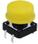|
|13|轻触按键|12*12*7.3MM 插件|4||
|17|蜂鸣器|有源 12*9.5MM 5V 普通分体 2300Hz|1||
|18|蜂鸣器|无源 12*8.5MM 5V 普通分体 2K|1|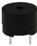|
|19|光敏电阻|5516 亮电阻5-10KΩ 暗电阻0.2MΩ|2||
|20|热敏电阻|5MM 103 阻值 10K 绿色 插件|2||
|21|滚珠开关|HDX-2801 两脚一样|2|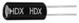|
|22|数码管|一位0.56英寸共阴红|1||
|23|数码管|四位0.36英寸共阴红 3461AH|1|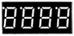|
|24|点阵|20*20MM 1.9MM 红色 共阳|1|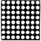|
|25|IC|74HC595 DIP|1|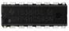|
|24|可调电位器|3386 MU 103（三针直排）|1||
|25|二极管|1N4007插件 KED|2||
|26|传感器元件|LM35DZ|1||
|27|传感器元件|红外接收 5MM 火焰|1|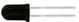|
|28|舵机|SG90 9G 23*12.2*29mm 蓝色 辉盛(环保）|1|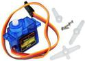|
|29|排针|1*40P 黑色 2.54 针长3.0等边|1|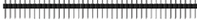|
|30|面包板|830孔 ZY-102（ 未包装）|1|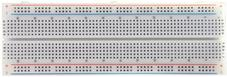|
|30|面包线|面包板连接线50根|1||
|31|电池盒+插杆|4节5号带线15CM露线2侧小孔+插杆|1|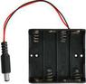|
|32|电阻卡|100*70MM|1|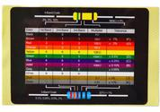|
|33|元件盒|绿色 2# 绿 75×31.5×21.5 16克|1|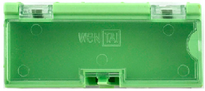|

