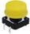
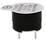
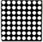
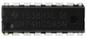
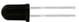
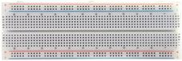
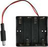
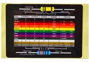

.. _2、清单:

2、清单
=======

.. container:: table-wrapper

   +------+-------------+-------------------------------------------+------+-----------+
   | 编码 | 名称        | 描述                                      | 数量 | 图片      |
   +======+=============+===========================================+======+===========+
   | 1    | LED         | F5-红发红-短                              | 10   | |image34| |
   +------+-------------+-------------------------------------------+------+-----------+
   | 2    | LED         | F5-黄发黄-短                              | 10   | |image35| |
   +------+-------------+-------------------------------------------+------+-----------+
   | 3    | LED         | F5-蓝发蓝-短                              | 10   | |image36| |
   +------+-------------+-------------------------------------------+------+-----------+
   | 4    | LED         | F5-绿发绿-短                              | 10   | |image37| |
   +------+-------------+-------------------------------------------+------+-----------+
   | 5    | LED         | F5-全彩RGB透明共阴                        | 1    | |image38| |
   +------+-------------+-------------------------------------------+------+-----------+
   | 6    | 电阻        | 碳膜色环 1/4W 1% 220R 编带                | 10   | |image39| |
   +------+-------------+-------------------------------------------+------+-----------+
   | 7    | 电阻        | 碳膜色环 1/4W 1% 1K 编带                  | 10   | |image40| |
   +------+-------------+-------------------------------------------+------+-----------+
   | 8    | 电阻        | 碳膜色环 1/4W 1% 10K 编带                 | 10   | |image41| |
   +------+-------------+-------------------------------------------+------+-----------+
   | 9    | 陶瓷电容    | 10NF 103 2.54                             | 10   | |image42| |
   +------+-------------+-------------------------------------------+------+-----------+
   | 10   | 陶瓷电容    | 100NF 104 2.54                            | 10   | |image43| |
   +------+-------------+-------------------------------------------+------+-----------+
   | 11   | 电解电容    | 100UF 16V 5*11MM 插件                     | 5    | |image44| |
   +------+-------------+-------------------------------------------+------+-----------+
   | 12   | 按键帽      | A24 黄帽(12\ *12*\ 7.3)圆                 | 4    | |image45| |
   +------+-------------+-------------------------------------------+------+-----------+
   | 13   | 轻触按键    | 12\ *12*\ 7.3MM 插件                      | 4    | |image46| |
   +------+-------------+-------------------------------------------+------+-----------+
   | 17   | 蜂鸣器      | 有源 12*9.5MM 5V 普通分体 2300Hz          | 1    | |image47| |
   +------+-------------+-------------------------------------------+------+-----------+
   | 18   | 蜂鸣器      | 无源 12*8.5MM 5V 普通分体 2K              | 1    | |image48| |
   +------+-------------+-------------------------------------------+------+-----------+
   | 19   | 光敏电阻    | 5516 亮电阻5-10KΩ 暗电阻0.2MΩ             | 2    | |image49| |
   +------+-------------+-------------------------------------------+------+-----------+
   | 20   | 热敏电阻    | 5MM 103 阻值 10K 绿色 插件                | 2    | |image50| |
   +------+-------------+-------------------------------------------+------+-----------+
   | 21   | 滚珠开关    | HDX-2801 两脚一样                         | 2    | |image51| |
   +------+-------------+-------------------------------------------+------+-----------+
   | 22   | 数码管      | 一位0.56英寸共阴红                        | 1    | |image52| |
   +------+-------------+-------------------------------------------+------+-----------+
   | 23   | 数码管      | 四位0.36英寸共阴红 3461AH                 | 1    | |image53| |
   +------+-------------+-------------------------------------------+------+-----------+
   | 24   | 点阵        | 20*20MM 1.9MM 红色 共阳                   | 1    | |image54| |
   +------+-------------+-------------------------------------------+------+-----------+
   | 25   | IC          | 74HC595 DIP                               | 1    | |image55| |
   +------+-------------+-------------------------------------------+------+-----------+
   | 24   | 可调电位器  | 3386 MU 103（三针直排）                   | 1    | |image56| |
   +------+-------------+-------------------------------------------+------+-----------+
   | 25   | 二极管      | 1N4007插件 KED                            | 2    | |image57| |
   +------+-------------+-------------------------------------------+------+-----------+
   | 26   | 传感器元件  | LM35DZ                                    | 1    | |image58| |
   +------+-------------+-------------------------------------------+------+-----------+
   | 27   | 传感器元件  | 红外接收 5MM 火焰                         | 1    | |image59| |
   +------+-------------+-------------------------------------------+------+-----------+
   | 28   | 舵机        | SG90 9G 23\ *12.2*\ 29mm 蓝色 辉盛(环保） | 1    | |image60| |
   +------+-------------+-------------------------------------------+------+-----------+
   | 29   | 排针        | 1*40P 黑色 2.54 针长3.0等边               | 1    | |image61| |
   +------+-------------+-------------------------------------------+------+-----------+
   | 30   | 面包板      | 830孔 ZY-102（ 未包装）                   | 1    | |image62| |
   +------+-------------+-------------------------------------------+------+-----------+
   | 30   | 面包线      | 面包板连接线50根                          | 1    | |image63| |
   +------+-------------+-------------------------------------------+------+-----------+
   | 31   | 电池盒+插杆 | 4节5号带线15CM露线2侧小孔+插杆            | 1    | |image64| |
   +------+-------------+-------------------------------------------+------+-----------+
   | 32   | 电阻卡      | 100*70MM                                  | 1    | |image65| |
   +------+-------------+-------------------------------------------+------+-----------+
   | 33   | 元件盒      | 绿色 2# 绿 75×31.5×21.5 16克              | 1    | |image66| |
   +------+-------------+-------------------------------------------+------+-----------+

.. |image1| image:: media/1eba37a568de56317c9b9a59738e76ee.png
.. |image2| image:: media/c871ecd95ce2be359e1ac2babcfcfaeb.png

.. |image4| image:: media/fb6f7a17d1cd0704124dd36063ef06bd.png
.. |image5| image:: media/edf0ee5faa95d2322ac7202210cbb1bf.jpg
.. |image6| image:: media/f6a8649da4e79abb2f1d15479f073bb5.jpg
.. |image7| image:: media/f6a8649da4e79abb2f1d15479f073bb5.jpg
.. |image8| image:: media/f6a8649da4e79abb2f1d15479f073bb5.jpg
.. |image9| image:: media/c6adec13381acac501af4d83d3036c7e.jpg
.. |image10| image:: media/805cef5e0b63e9488fb1ac1e92fba474.jpg
.. |image11| image:: media/21886581bcce7e7f1198116ed5de42dc.jpg

.. |image15| image:: media/0c80123578173c033dcc8f1b73b1a58b.jpg
.. |image16| image:: media/c09cb519c3304d4c23eb6c479657c4d0.jpg
.. |image17| image:: media/9911fc31c9c129308adb141b564f69b9.png
.. |image18| image:: media/4c38f358a550b7fe0a3710264d51caf2.jpg
.. |image19| image:: media/7787953ef7619ae3753a3324751ceffc.jpg
.. |image20| image:: media/ee1041a554ca5afac06a3fb6239f0902.jpg

.. |image23| image:: media/6d6025bc96667b6f44070355f2041f13.jpg

.. |image25| image:: media/c971ffe64d81aea1a195c9b7ae517b24.jpg

.. |image27| image:: media/57a1e55e27c82e0ae9aa0b8d88e24b17.jpg
.. |image28| image:: media/c1a95d6334a4e20388ddb5a75683c495.png

.. |image30| image:: media/a741fbc4b471318a5e3ef45f3871c07c.png

.. |image33| image:: media/14e3865259225cc6ece92bd01c0518ba.png
.. |image34| image:: media/1eba37a568de56317c9b9a59738e76ee.png
.. |image35| image:: media/c871ecd95ce2be359e1ac2babcfcfaeb.png

.. |image37| image:: media/fb6f7a17d1cd0704124dd36063ef06bd.png
.. |image38| image:: media/edf0ee5faa95d2322ac7202210cbb1bf.jpg
.. |image39| image:: media/f6a8649da4e79abb2f1d15479f073bb5.jpg
.. |image40| image:: media/f6a8649da4e79abb2f1d15479f073bb5.jpg
.. |image41| image:: media/f6a8649da4e79abb2f1d15479f073bb5.jpg
.. |image42| image:: media/c6adec13381acac501af4d83d3036c7e.jpg
.. |image43| image:: media/805cef5e0b63e9488fb1ac1e92fba474.jpg
.. |image44| image:: media/21886581bcce7e7f1198116ed5de42dc.jpg

.. |image48| image:: media/0c80123578173c033dcc8f1b73b1a58b.jpg
.. |image49| image:: media/c09cb519c3304d4c23eb6c479657c4d0.jpg
.. |image50| image:: media/9911fc31c9c129308adb141b564f69b9.png
.. |image51| image:: media/4c38f358a550b7fe0a3710264d51caf2.jpg
.. |image52| image:: media/7787953ef7619ae3753a3324751ceffc.jpg
.. |image53| image:: media/ee1041a554ca5afac06a3fb6239f0902.jpg

.. |image56| image:: media/6d6025bc96667b6f44070355f2041f13.jpg

.. |image58| image:: media/c971ffe64d81aea1a195c9b7ae517b24.jpg

.. |image60| image:: media/57a1e55e27c82e0ae9aa0b8d88e24b17.jpg
.. |image61| image:: media/c1a95d6334a4e20388ddb5a75683c495.png

.. |image63| image:: media/a741fbc4b471318a5e3ef45f3871c07c.png

.. |image66| image:: media/14e3865259225cc6ece92bd01c0518ba.png
